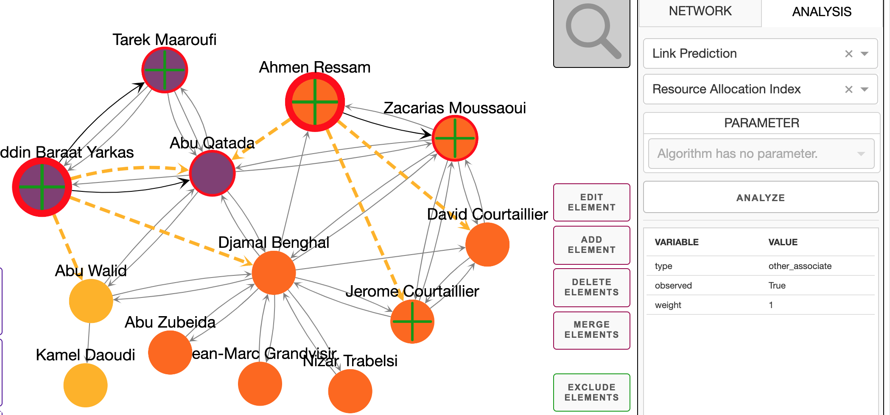

# CrimeNet — Criminal Network Analysis & Visualization

[](https://www.python.org/)
[](https://dash.plotly.com/)
[](https://networkx.org/)
[](https://flask.palletsprojects.com/)
[](LICENSE)

[](https://github.com/VishalRajExe/CrimeNet)

---

## Overview

**CrimeNet** is an interactive web-based visualization and analysis tool for criminal network graphs. It provides a rich set of graph analytics capabilities including:

- **Community Detection** — Louvain, Spectral Clustering, Agglomerative Clustering, Girvan-Newman, and more
- **Social Influence Analysis** — PageRank, HITS Authority/Hub scores, degree centrality
- **Link Prediction** — Predict new criminal associations using Jaccard, Adamic-Adar, Common Neighbors, etc.
- **Node Embedding** — SVD, NMF, DeepWalk, Node2Vec
- **Interactive Visualization** — Cytoscape.js with cose-bilkent physics layout, click-to-inspect, node/edge filtering

The project includes **14 pre-processed criminal network datasets** ready to load and explore.

---

## Project Structure

```
CrimeNet/
├── visualizer/             # Web UI — Dash app, layout, callbacks, assets
│   ├── index.py            # Entry point — run this to start the server
│   ├── app.py              # Dash application, callbacks, Flask routes
│   ├── dash_layout.py      # UI layout definition
│   ├── dash_formatter.py   # Dash component helpers
│   ├── dash_style.py       # Cytoscape stylesheet management
│   ├── dash_io.py          # Dash input/output/state definitions
│   ├── io_utils.py         # JSON format converters
│   └── assets/             # CSS, favicon, Cytoscape JSON stylesheet
│
├── analyzer/               # Analysis engine
│   ├── community_detection.py
│   ├── social_influence_analysis.py
│   ├── link_prediction.py
│   ├── node_embedding.py
│   ├── request_taker.py
│   ├── common/             # Shared helpers and constants
│   └── ge/                 # Graph Embedding models (DeepWalk, Node2Vec, LINE, SDNE)
│
├── storage/
│   └── builtin_datasets.py # In-memory data management (ActiveNetwork, BuiltinDatasetsManager)
│
├── framework/
│   └── interfaces.py       # Abstract base classes
│
├── conductor/              # Optional REST API server (Flask + Celery + Redis)
│   ├── settings.yaml
│   └── src/
│
├── datasets/
│   └── preprocessed/       # 14 criminal network JSON files
│
├── tester/                 # Example scripts for components
├── tests/                  # Unit tests
└── requirements.txt        # Python dependencies reference
```

---

## Included Datasets

| Dataset ID | Display Name | Description |
|---|---|---|
| `911_hijackers` | 911 Hijackers | Network of the 9/11 hijackers |
| `israel_lea_case1` | Israel Lea Case 1 | LEA case speaker network |
| `israel_lea_case2` | Israel Lea Case 2 | LEA case speaker network |
| `baseball_steroid_use` | Baseball Steroid Use | Co-offender doping network |
| `bbc_islam_groups` | BBC Islam Groups | Extremist group network |
| `csi_s01e07` | CSI (s01e07) | Crime fiction dataset |
| `csi_s01e08` | CSI (s01e08) | Crime fiction dataset |
| `madoff` | Madoff Frauds | Investment fraud network |
| `montreal_gangs` | Montreal Street Gangs | Gang co-offending network |
| `moreno_crime` | Moreno Crime Network | Sociogram crime data |
| `nist_c1` | NIST C1 | NIST criminal network benchmark |
| `nist_c2` | NIST C2 | NIST criminal network benchmark |
| `noordintop` | Noordin Top | Terrorist network |
| `rhodes_bombing` | Rhodes Bombing | Bombing suspect network |

---

## Requirements

- **Python 3.10 or higher** (tested on 3.13)
- Windows / Linux / macOS
- No database required — all data is loaded in-memory from JSON files
- No external API keys or credentials needed for the core visualizer

---

## Installation

### 1. Clone the Repository

```bash
git clone https://github.com/VishalRajExe/CrimeNet.git
cd CrimeNet
```

### 2. Install Dependencies

```bash
pip install dash==2.18.1 dash-cytoscape==0.3.0 dash-bootstrap-components==1.6.0 \
  flask==2.3.3 flask-compress==1.14 networkx==3.3 pandas scipy scikit-learn \
  seaborn matplotlib plotly==5.22.0 PyYAML==6.0.2 requests==2.32.3 \
  gensim tqdm easydict texttable Werkzeug==3.0.3 joblib fastdtw
```

> **Note:** The `requirements.txt` in the root contains the original pinned versions from the Python 3.7 era.  
> For Python 3.10+, use the versions listed above (all available as pre-built wheels — no compiler needed).

---

## Running the Application

Start the visualizer from the **project root**:

```bash
python visualizer/index.py
```

The server starts on port **8050**:

| URL | Access |
|---|---|
| `http://127.0.0.1:8050` | Local (this machine) |
| `http://0.0.0.0:8050` | All network interfaces |

### Optional Flags

```bash
# Debug mode (auto-reload on file change)
python visualizer/index.py --debug

# Load additional custom datasets from a folder
python visualizer/index.py --data /path/to/custom/datasets/

# Bind to a specific host address
python visualizer/index.py --host 0.0.0.0
```

---

## Usage Guide

1. Open `http://127.0.0.1:8050` in your browser
2. **NETWORK tab** (right sidebar): select a network from the dropdown, optionally filter entities, then click **Load Network**
3. **ANALYSIS tab**: choose an analysis type (Community Detection, Link Prediction, etc.) and an algorithm, then click **Analyze**
4. **Click nodes/edges** to inspect their properties in the info panel
5. Use **Edit/Add/Delete/Merge Element** buttons to modify the network
6. **Save Network State** — exports the current view as JSON
7. **Export Network** — downloads the full network in new JSON format
8. **Export Image** — saves the current graph as PNG

---

## Technology Stack

| Layer | Technology | Version |
|---|---|---|
| Web Framework | Dash (on Flask) | 2.18.1 |
| Graph Visualization | Cytoscape.js via dash-cytoscape | 0.3.0 |
| UI Components | dash-bootstrap-components | 1.6.0 |
| Backend Server | Flask | 2.3.3 |
| Graph Library | NetworkX | 3.3 |
| Data Analysis | pandas, scipy, scikit-learn | latest |
| Graph Embeddings | Gensim (Word2Vec) | 4.4.0 |
| Language | Python | 3.13 |

---

## Known Limitations

- **LINE and SDNE embeddings** use TensorFlow 1.x, which is incompatible with Python 3.10+. These two embedding methods are gracefully disabled at import time. All other functionality (SVD, NMF, DeepWalk, Node2Vec, all analyses) works correctly.
- **roxsd_drug / roxsd_money datasets** were part of the proprietary ROXANNE EU research project and are not included in this public repository. All 14 other datasets are fully functional.
- The **Conductor API server** (`/conductor/`) is an optional REST API layer requiring Redis. It is not needed to run the visualizer.

---

## Citation

> Ahmadi, Z., Nguyen, H. H., Zhang, Z., Bozhkov, D., Kudenko, D., Jofre, M., Calderoni, F., Cohen, N., & Solewicz, Y. (2023). *Inductive and Transductive Link Prediction for Criminal Network Analysis.* Journal of Computational Science. [Preprint](https://hoanghnguyen.com/assets/pdf/ahmadi2023inductive.pdf)

```bibtex
@article{ahmadi2023inductive,
  title = {Inductive and Transductive Link Prediction for Criminal Network Analysis},
  author = {Ahmadi, Zahra and Nguyen, Hoang H. and Zhang, Zijian and Bozhkov, Dmytro
            and Kudenko, Daniel and Jofre, Maria and Calderoni, Francesco and Cohen, Noa
            and Solewicz, Yosef},
  journal = {Journal of Computational Science},
  publisher = {Elsevier},
  volume = {72},
  pages = {102063},
  year = {2023},
  doi = {https://doi.org/10.1016/j.jocs.2023.102063},
  url = {https://www.sciencedirect.com/science/article/pii/S1877750323001230}
}
```

---

## License-

Licensed under the ROXANNE Research License. See [LICENSE](LICENSE) for details.

Graph embedding models (DeepWalk, Node2Vec, LINE, SDNE) originally authored by Weichen Shen.

